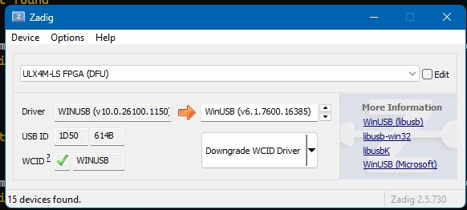

# Hazard3 Doom ULX4M port status

The existing `ULX3S.mk` build and its default 64 MiB software memory profile
remain unchanged. The first ULX4M milestone adds a separate ULX4M-LS v0.0.2
board wrapper, constraints, and 32 MiB SDRAM profile without changing the
proven ULX3S top level.

## Programming the ULX4M

All examples start from the workspace directory:

```bash
WORKSPACE=/mnt/c/workspace/
PROJECT_WORKSPACE="$WORKSPACE/Hazard3"
```

### Quick Start FPGA

Build from the `example_soc/synth` directory. Optionally name the window `ULX4M SoC`.

With power disconnected, move either ULX4M `SW1` slider to its `ON`
position, then connect USB power. LED0-LED2 should remain on and Windows should
enumerate the DFU device.



The ULX4M identifier is `1D50-614B`.

Complete synthesis:

```bash
# e.g. /mnt/c/workspace/Hazard3/example_soc/synth
cd ${PROJECT_WORKSPACE}/example_soc/synth

make -B -f ULX4M_LD_85F.mk bit-um
```

Program using `openFPGALoader`:

```bash
./openFPGALoader.exe --dfu --vid 0x1d50 --pid 0x614b --altsetting 0 \
    fpga_ulx4m_ld_um85.bit
```

After programming:

- Unplug USB.
- Move both ULX4M `SW1` sliders to `OFF`.
- Re-plug USB without holding any buttons.
- The full ULX4M-LD image should blink D7 at approximately 1 Hz. D7 is
  clocked directly from `clk_osc`, so this heartbeat does not depend on
  Hazard3, either PLL, DDR3 calibration, or firmware.

If D7 does not blink, first use the standalone configuration diagnostic. It
blinks all eight module LEDs together at 1 Hz and contains no SoC, PLL, DDR3,
HDMI, or UART logic:

```bash
# Build for an LFE5UM-85F device.
make -B -f ULX4M_LD_BLINKY_85F.mk bit-um

# Build for an LFE5UM5G-85F device.
make -B -f ULX4M_LD_BLINKY_85F.mk bit-um5g
```

The resulting files are:

- `fpga_ulx4m_ld_blinky_um85.bit`
- `fpga_ulx4m_ld_blinky_um5g85.bit`

The ECP5 family encoded by `ecppack` must match the selected nextpnr device.
The shared `fpgascripts/synth_ecp5.mk` default is `0x41113043`, which is the
IDCODE for `LFE5U-85F`, not `LFE5UM-85F`. These ULX4M makefiles override it
as follows:

- `LFE5UM-85F`: `0x01113043`
- `LFE5UM5G-85F`: `0x81113043`

For the installed `LFE5UM-85F-8BG381C`, the build log must therefore show:

```text
nextpnr-ecp5 ... --um-85k ... --speed 8 ...
ecppack ... --idcode 0x01113043 ...
```

Program only the file matching the exact marking on the FPGA package. For
example:

```bash
./openFPGALoader.exe --dfu --vid 0x1d50 --pid 0x614b --altsetting 0 \
    fpga_ulx4m_ld_blinky_um85.bit
```

After the download, disconnect power, move both ULX4M `SW1` sliders to
`OFF`, and reconnect power without holding any module button. The Windows
`openFPGALoader.exe` transfer already sends the final zero-length DFU download
request; a separate Linux `dfu-util` command is not required for this WSL
programming path.

The full SoC target accepts the same explicit device selection. For this
board, use the UM targets:

```bash
make -B -f ULX4M_LD_85F.mk bit-um
make -f ULX4M_LD_85F.mk program-um
```

The full ULX4M-LD FPGA, 25 MHz monitor, and matching 64 MiB Doom image can be
built together with:

```bash
./build-ulx4m-ld-doom.sh
```

### Quick Start Firmware

```bash
cd ${PROJECT_WORKSPACE}/example_soc/synth/hazard3-fw
HAZARD3_MEMORY_PROFILE=64m HAZARD3_SYS_CLK_HZ=25000000 ./build.sh
```

The monitor waits up to five seconds for external-memory calibration before
running its boot test. A timeout leaves the UART monitor responsive and blocks
external-memory and Doom operations until the DDR3 ready bit appears.

## Added target: ULX4M-LS v0.0.2, 85F FPGA

`ULX4M_LS_85F.mk` uses:

- the 25 MHz module oscillator and existing 50 MHz Hazard3 clock;
- the ULX4M-LS 32 MiB, 16-bit SDR SDRAM with nine column-address bits;
- the HAT FTDI UART (`N4` FPGA RX, `N3` FPGA TX);
- the primary GPDI connector with explicit positive and negative outputs;
- the existing ECP5 JTAGG-based Hazard3 debug transport;
- a board-specific Doom memory map selected with
  `HAZARD3_MEMORY_PROFILE=32m`.

Build the FPGA from `example_soc/synth`:

```bash
make -f ULX4M_LS_85F.mk clean
make -f ULX4M_LS_85F.mk bit
```

Build matching monitor and Doom software from `example_soc/synth/hazard3-fw`:

```bash
HAZARD3_MEMORY_PROFILE=32m ./build.sh
HAZARD3_MEMORY_PROFILE=32m ./doom/build-doom-image.sh
```

Upload the IWAD with the same profile:

```bash
python doom/upload-wad.py doom1.wad \
    --port COM7 \
    --memory-profile 32m \
    --launch
```

Program through the HAT JTAG/FTDI interface:

```bash
make -f ULX4M_LS_85F.mk prog
```

Or program through the native ULX4M DFU bootloader:

```bash
make -f ULX4M_LS_85F.mk dfu
```

### ULX4M-LS 32 MiB memory map

- `0x20000000-0x21ffffff`: physical SDRAM
- `0x24000000-0x25ffffff`: uncached diagnostic alias
- `0x20100000-0x203fffff`: linked Doom image
- `0x20400000-0x20ffffff`: 12 MiB heap
- `0x21000000-0x21bfffff`: 12 MiB IWAD reservation
- `0x21c00000-0x21ffffff`: uncached video reservation

The 12 MiB IWAD reservation fits the Ultimate Doom `DOOM.WAD`/`DOOM1.WAD`
size, but not larger IWADs such as Doom II. The original ULX3S profile keeps
its 16 MiB IWAD reservation.

## Why the common ULX4M-LS 12F is not selected

The current ULX3S place-and-route report uses 164 DP16KD blocks. The ECP5-12F
cannot fit that architecture. The largest consumers are the 128 KiB internal
SRAM and the two complete 320x200 block-RAM display frames.

A compact 12F profile needs architectural changes rather than a device switch:

- move the Doom working screen out of internal block RAM;
- replace the two full display-frame block-RAM banks with a line buffer or
  direct SDRAM scanout;
- reduce the monitor internal SRAM allocation;
- re-run timing and SDRAM bandwidth qualification.

## ULX4M-LD 85F

ULX4M-LD replaces SDR SDRAM with DDR3. Its FPGA capacity is sufficient, but its
memory is not electrically or logically compatible with
`ulx3s_sdram_controller.v`. 

The correct path is an ECP5 DDR3 PHY/controller,
such as LiteDRAM's `ECP5DDRPHY`, behind a new AHB adapter. Do not apply the
ULX4M-LS constraints or SDR controller to an ULX4M-LD board.

The LD RTL now includes the native UberDDR3 controller, AHB bridge, unified
cache, HDMI frame-transfer arbitration, and the existing 64 MiB software map.
The remaining milestone is hardware qualification:

1. confirm DDR3 calibration reaches completion;
2. run the quick, alias, pseudorandom, heap, and execute-from-DDR tests;
3. verify the HDMI test frame through the carrier HDMI0 connector;
4. upload and launch the linked Doom image and IWAD;
5. measure frame-copy and presentation counters before treating the target as
   fully supported.

## Validation state

ULX4M-LD standalone blinky has been built, programmed through DFU, and booted
successfully on an `LFE5UM-85F-8BG381C` device using `--um-85k`, `--speed 8`,
and IDCODE `0x01113043`. This proves the corrected FPGA selection, DFU write,
boot, oscillator, and LED constraints.

The common source has also been checked for address-map consistency, LPF port
coverage, duplicate pin assignments, shell/Python/C syntax, and matching 64 MiB
monitor and Doom profiles. The full Hazard3 + DDR3 + HDMI image still requires
an exact UM rebuild and hardware qualification of DDR3 calibration, external
memory tests, HDMI output, Doom image loading, and IWAD launch before ULX4M-LD
can be considered fully supported.
